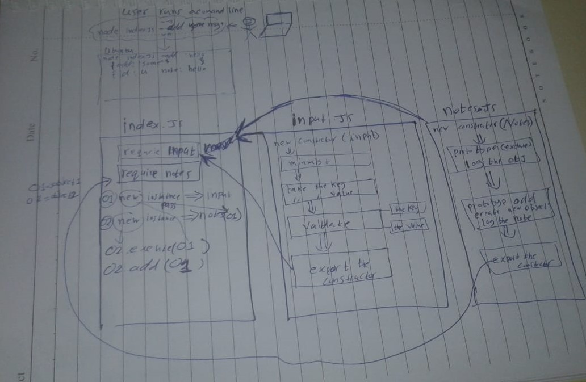

# LAB - 01

## Node Ecosystem

### Author: Osama Abu Mousa

### Links and Resources

- [submission PR](https://github.com/401-advanced-javascript-osama/notes/pull/3)

### Modules
#### `Node.js`
### Packages
#### `minimist`

#### How to initialize/run your application (where applicable)

- e.g. `node index.js --add 'creating my first note'`
- e.g. `node index.js -a 'creating my first note'`
- e.g. `node index.js --a 'creating my first note'`
- e.g. `./index.js --add 'creating my first note'`
- e.g. `./index.js -a 'creating my first note'`
- e.g. `./index.js --a 'creating my first note'`

#### How to use your library (where applicable)

#### Tests
- Test: '`node index.js (anything except [--add || -a || --a]) 'creating my first note'`' => 'you should use (--add) or (--a/-a) to add a message'

- Unit Tests : `npm test`
- Unit Tests : `npm run lint`
#### UML

